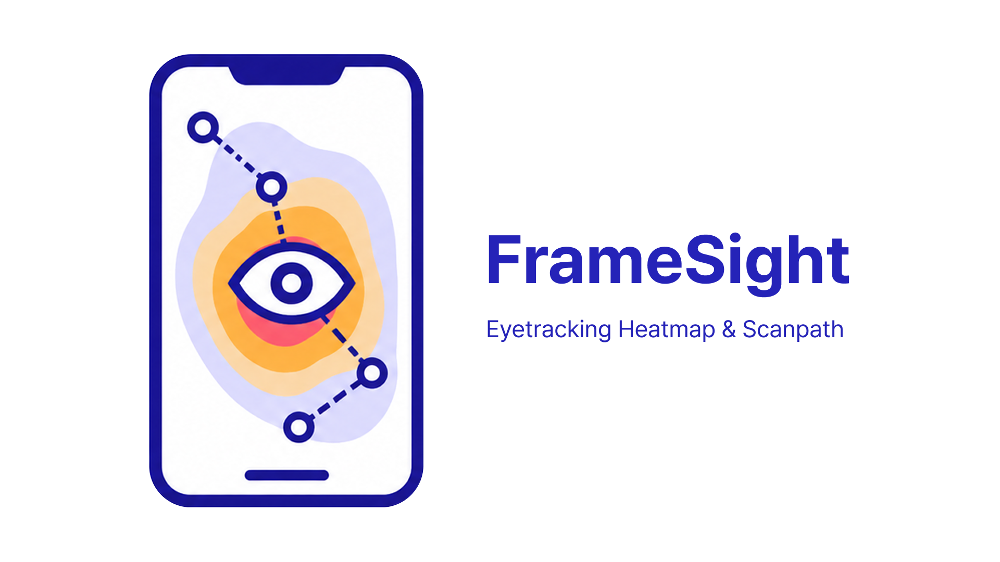
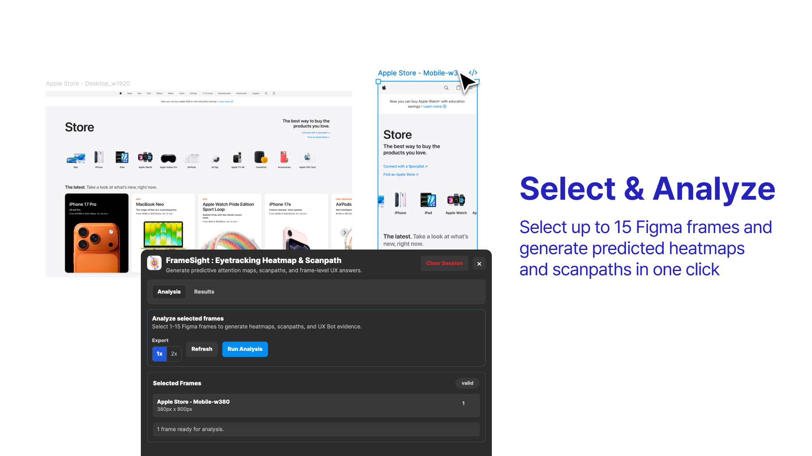
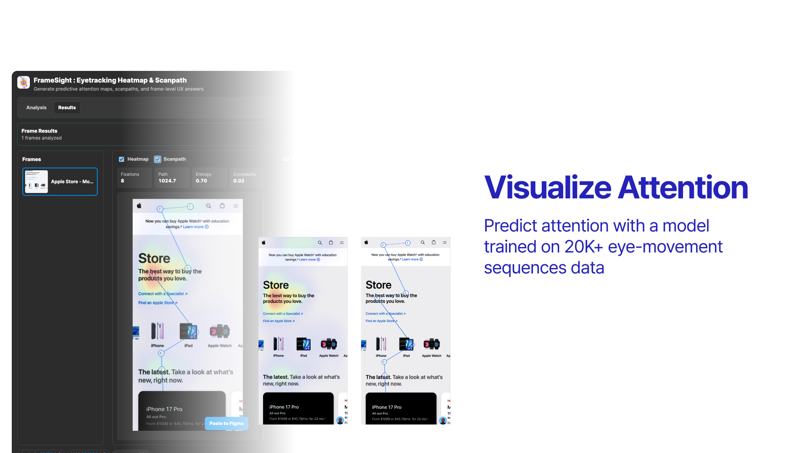
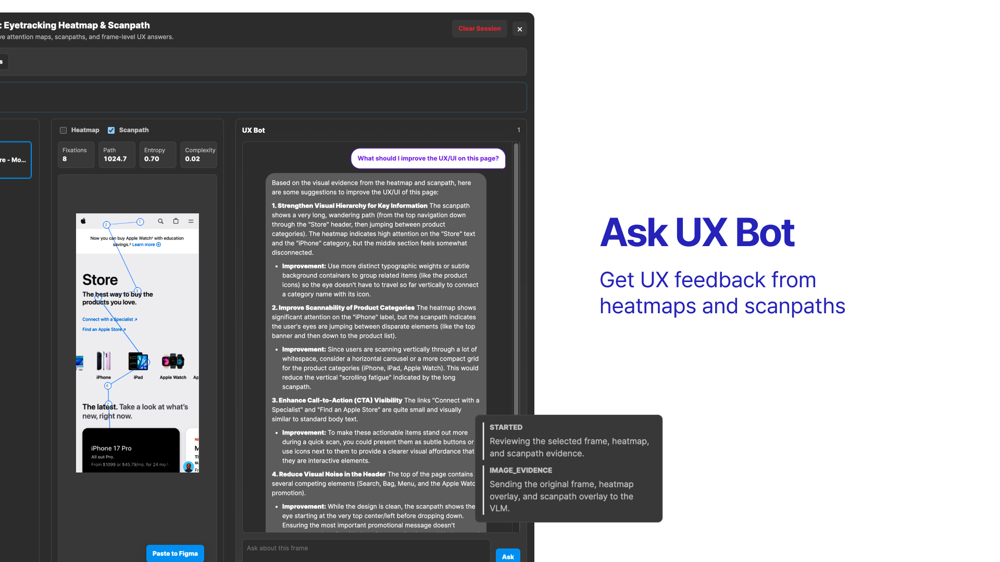

# FrameSight: Eyetracking Heatmap & Scanpath

FrameSight는 Figma에서 선택한 UI 프레임의 시각적 주목도를 예측해 Heatmap과 Scanpath로 보여주고, 분석 결과를 바탕으로 UX 개선 의견을 제공하는 Figma 플러그인입니다.

[**Figma Community에서 FrameSight 사용하기**](https://www.figma.com/community/plugin/1650870075265749026/framesight-eyetracking-heatmap-scanpath)

[](https://www.figma.com/community/plugin/1650870075265749026/framesight-eyetracking-heatmap-scanpath)

## 주요 기능

### 여러 프레임을 한 번에 분석

Figma에서 1~15개의 프레임을 선택하고 한 번의 실행으로 예측 Heatmap과 Scanpath를 생성할 수 있습니다.



### 시각적 주목도 확인

원본 화면과 Heatmap, Scanpath를 비교하면서 중요한 콘텐츠가 충분히 눈에 띄는지, 시선 흐름이 의도한 동선을 따르는지 확인할 수 있습니다.



### UX Bot에게 질문

선택한 프레임과 시각적 분석 결과를 근거로 UX Bot에게 질문하고, 화면의 정보 위계와 가독성, CTA 노출 등에 대한 개선 의견을 받을 수 있습니다.



## 사용 방법

1. [Figma Community의 FrameSight 페이지](https://www.figma.com/community/plugin/1650870075265749026/framesight-eyetracking-heatmap-scanpath)에서 플러그인을 엽니다.
2. 분석할 Figma 프레임을 1~15개 선택합니다.
3. `Run Analysis`를 클릭합니다.
4. 결과 화면에서 Heatmap과 Scanpath를 비교하고 UX Bot에게 필요한 질문을 입력합니다.
5. 디자인을 수정한 후 다시 분석해 결과를 비교합니다.

> FrameSight의 결과는 예측 기반의 시각적 주목도 분석입니다. 실제 아이트래킹 조사, 사용성 테스트 또는 사용자 리서치를 대체하지 않으며 초기 디자인 검토와 가설 수립을 위한 보조 자료로 사용하는 것을 권장합니다.

## Development

```bash
npm install
npm run build
```

Figma Desktop에서 `manifest.json`을 import하면 됩니다. 개발 중에는 `npm run dev`로 `dist/`를 watch build할 수 있습니다.

## API

분석 서버 기본 URL은 `https://eyetrack.newlearn.ai.kr`입니다.

- `GET /api/v1/health`
- `POST /api/v1/flow/analyze`
- `POST /api/v1/flow/prepare-target`
- `POST /api/v1/ux/chat`
- `POST /api/v1/ux/chat/heuristic`

서버는 분석 결과를 저장하지 않으며, 플러그인이 `analysis_bundle`, target별 `target_result`, UX chat history를 `figma.clientStorage`에 저장합니다.
